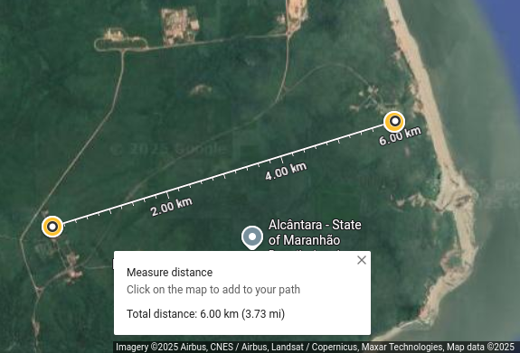
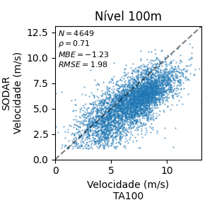
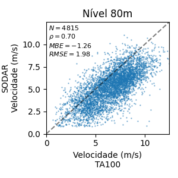
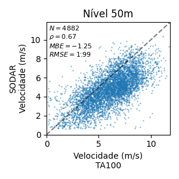
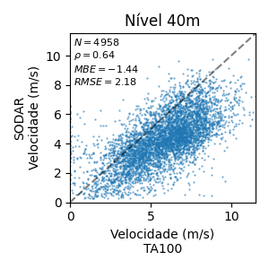
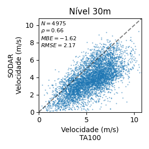
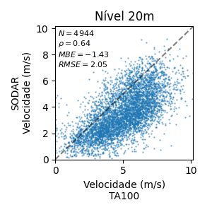
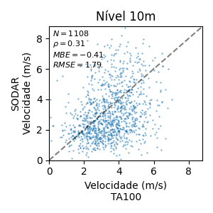

# Verificação da velocidade do vento medida por SODAR e Torre Anemométrica em aplicações de Meteorologia Aeroespacial

Diogo Machado Custodio

Instituto de Aeronáutica e Espaço - IAE

São José dos Campos, SP, Brasil

diogodmc@fab.mil.br

**RESUMO**

A acurácia das medidas do perfil vertical do vento é crucial para a segurança e eficiência das operações
de lançamento de artefatos espaciais. Este trabalho apresenta uma análise de verificação dos dados de
velocidade do vento obtidos por um sistema SODAR (Sound Detection And Ranging) marca/modelo
Scintec SFAS, utilizando como referência as medições da Torre Anemométrica de 100m (TA100)
do Centro de Lançamento de Alcântara (CLA). Foram analisados dados coletados no período de
novembro de 2022 a novembro de 2023, com resolução temporal de 30 minutos, abrangendo dez
níveis de altura (de 10m a 100m). A análise estatística, baseada no Coeficiente de Correlação de
Pearson (ρ), Viés Médio (MBE) e Raiz do Erro Quadrático Médio (RMSE), revelou que a correlação
é fraca (ρ = 0,31) no nível de 10m, mas se torna moderada a forte a partir de 20m de altura,
variando de ρ = 0,64 a ρ = 0,71. O SODAR apresentou um viés negativo consistente, subestimando
a velocidade do vento em aproximadamente 0,4 a 1,6 m/s em relação à TA100. Os resultados indicam
que o SODAR pode ser um instrumento útil para o monitoramento do perfil de vento acima de 20m,
fornecendo dados com confiabilidade adequada para aplicações de apoio à decisão em meteorologia
aeroespacial, desde que consideradas as incertezas e viés sistemático.

**Palavras-chave:** SODAR; Torre Anemométrica; Perfil de Vento; Meteorologia Aeroespacial; Verificação Estatística de Dados.

## 1 INTRODUÇÃO

Na Meteorologia Aeroespacial, a vigilância das condições atmosféricas, em especial do perfil vertical do vento, desempenha papel crucial no êxito das operações de lançamento de veículos espaciais
(MARQUES; FISCH, 2005). O vento exerce influência decisiva tanto na segurança das operações

terrestres, quanto na estabilidade e trajetória do veículo durante o voo (FISCH et al., 2015). Tradicionalmente, as medições de vento em superfície e baixas altitudes são realizadas por torres anemométricas, que fornecem dados pontuais de alta confiabilidade em alturas específicas (CARUZZO; BELDERRAIN; FISCH, 2021; CUSTODIO; YAMASAKI, 2018).

Contudo, o alcance das medições por torres é limitado a poucos níveis de altura e, além de serem inerentemente fixas, sua instalação e manutenção acarretam custos elevados. Nesse contexto, os perfiladores de vento por sensoriamento remoto, como o SODAR (_Sound Detection And Ranging_), surgem como alternativas complementares (WEBER et al., 1990). Esses equipamentos permitem monitorar continuamente o perfil vertical do vento em uma ampla faixa de alturas, fornecendo uma visão mais integrada da camada limite atmosférica.

A confiança nos dados é um requisito primário para sua utilização em cálculos de trajetória e definição de janelas de lançamento. Estudos anteriores exploraram a aplicação de perfiladores de vento no Centro de Lançamento de Alcântara (CLA) (CUSTODIO et al., 2016; CUSTODIO; CARDOSO NETO, 2024; CORREA; SOUZA; CARDOSO NETO, 2023). No entanto, a obtenção de novos equipamentos e a contínua verificação do desempenho desses em relação a instrumentos de medida consagrados é fundamental para validar sua aplicação operacional.

Nesse contexto, o presente trabalho tem como objetivo verificar **quantitativamente** a qualidade dos dados de **velocidade do vento** do SODAR, instalado no CLA, por meio da comparação com os dados da Torre Anemométrica de 100m (TA100), buscando fornecer subsídios objetivos para o seu emprego nas atividades de Meteorologia Aeroespacial em apoio às campanhas de lançamento de artefatos espaciais.

## 2 MATERIAIS E MÉTODOS

O estudo foi conduzido no CLA, situado no município de Alcântara, MA, região nordeste do Brasil. O CLA está geograficamente localizado nas coordenadas $2^{\circ}19^{\circ}$ S de latitude e $44^{\circ}22^{\circ}$ W de longitude, posicionado em uma área costeira estratégica que oferece condições favoráveis para operações de lançamento. Como um dos principais centros espaciais brasileiros, o CLA é responsável pelo lançamento e rastreio de artefatos espaciais, desempenhando papel fundamental no Programa Espacial Brasileiro (BELLINTANI; CUSTODIO, 2024).

Para este estudo, foram utilizados dados de dois instrumentos instalados em setores distintos do CLA:

* **SODAR:** O SODAR SFAS (Scintec) é um equipamento de sensoriamento remoto que utiliza ondas acústicas para medir o perfil vertical da velocidade e direção do vento. Seu alcance vertical de operação é de até 500m de altura, com resolução espacial de 5m e temporal de 30 minutos. Durante a campanha de coleta de dados para esse estudo, permaneceu instalado no campo instrumental da Seção de Meteorologia do CLA;

* **TA100:** É uma torre com 100 metros de altura instrumentada com anemômetros sônicos, marca/modelo RM Young 86000, instalados em 10 níveis de altura igualmente espaçados entre si: 10, 20, 30, 40, 50, 60, 70, 80, 90 e 100 metros. A TA100 está permanentemente instalada no
Setor de Preparação e Lançamento (SPL) do CLA e nesse estudo é considerada como referência
para a verificação.

**Figura 1:** Imagem de satélite demonstrando a posição e distância (6km) das instalações do SODAR
e TA100. Fonte: Google Earth.

Durante o experimento, os instrumentos estavam distantes entre si 6 km em linha reta, aproximadamente (Figura 1). Essa configuração foi adotada por duas razões principais: (i) o campo instrumental
da Seção de Meteorologia é onde tradicionalmente são realizadas outras medidas atmosféricas de altitude, como radiossondagens com balões, concentrando a infraestrutura de monitoramento; e (ii)
buscou-se avaliar a viabilidade operacional de manter o SODAR instalado permanentemente neste
local, facilitando a operação e manutenção de rotina pela equipe técnica. Ressalta-se que no trajeto
entre os instrumentos existe vegetação nativa com árvores de porte elevado, o que pode influenciar
as medições em baixos níveis atmosféricos.

A análise compreendeu o período de novembro de 2022 a novembro de 2023. Os dados de ambos
os sensores foram selecionados em pares referentes aos mesmos instantes de tempo, com intervalo de
30 minutos, para cada nível de altura correspondente.

Para garantir a qualidade da análise, foi realizado um pré-processamento para remoção de valores
espúrios (outliers). A detecção foi feita pelo método do Intervalo Interquartil (IQR), onde foram
descartados valores menores que $Q1 – 1,5 * IQR$ ou maiores que $Q3 + 1,5 * IQR$, sendo Q1 o
primeiro quartil (25%) e Q3 o terceiro quartil (75%) dos dados e $IQR = Q3 – Q1$.

### 2.1 Análise Estatística

A verificação foi realizada com a utilização das seguintes métricas estatísticas, calculadas para cada um dos 10 níveis de altura:

* **Coeficiente de Correlação de Pearson ($\rho$):** Mede a intensidade e a direção da relação linear entre as medidas do SODAR e da TA100 e é calculado da seguinte forma:

$$  \rho =
\frac{
    \sum (SODAR - \overline{SODAR})(TA100 - \overline{TA100})
}{
    \sqrt{
        \sum (SODAR - \overline{SODAR})^2
        \;\sum (TA100 - \overline{TA100})^2
    }
}  $$

* **Viés Médio (MBE - Mean Bias Error):** Indica a tendência sistemática de subestimar (valores negativos) ou superestimar (valores positivos) a velocidade do vento conforme medido pelo SODAR em relação à TA100. É calculado pela média do somatório das diferenças:

$$ MBE = \overline{\sum (SODAR - TA100)} $$

* **Raiz do Erro Quadrático Médio (RMSE - Root Mean Square Error):** Representa o erro absoluto médio entre as duas medições, sendo sensível a grandes desvios, e é calculado por:

$$ \mathrm{RMSE} = \sqrt{\overline{(SODAR - TA100)^2}} $$

O processamento dos dados e os cálculos estatísticos foram implementados utilizando a linguagem de programação Python e as bibliotecas Pandas, NumPy e Matplotlib. O código desenvolvido para as análises está disponibilizado em formato de Jupyter Notebook, disponível em Custodio (2025).

## 3 RESULTADOS E DISCUSSÃO

As análises foram feitas a partir dos gráficos de dispersão apresentados na Figura 2, para todos os níveis de altura.

### 3.1 Correlação entre as Medidas

Observa-se uma nítida diferença de desempenho do SODAR entre o nível de 10m e os demais. No nível mais baixo, a correlação é considerada fraca ($\rho = 0,31$), podendo ser atribuída a diversos fatores, como a influência de obstáculos superficiais, turbulência induzida pela rugosidade do terreno, possível interferência no sinal do SODAR devido à obstáculos ao nível do solo, e, especialmente pela distância de 6 km entre os instrumentos.

A partir do nível de 20m, a correlação aumenta para valores considerados moderados a fortes, variando entre 0,64 e 0,71. Esse resultado indica uma boa concordância linear entre os dois instrumentos acima da camada superficial mais instável. A correlação tende a aumentar ligeiramente com a altura, estabilizando-se em torno de 0,70 a partir de 60m.

**Figura 2:** Diagramas de dispersão da comparação entre SODAR e TA100 para todos os níveis de altura. A reta tracejada representa a diagonal de identidade ($\rho = 1$). Em cada quadro são apresentadas as respectivas métricas do número de amostras (N), correlação ($\rho$), MBE (m/s) e RMSE (m/s).

Destaca-se que, mesmo com a distância entre os instrumentos e a presença de obstáculos naturais
entre si, os valores de correlação nos níveis mais altos podem ser considerados bastante satisfatórios,
mesmo com os instrumentos instalados em localidades distintas.

### 3.2 Viés e Erro das Medidas

O Viés Médio (MBE) apresentou valores negativos em todos os níveis, demonstrando uma tendência
clara do SODAR em subestimar a velocidade do vento em relação à TA100. A velocidade do vento
é mais subestimada no nível de 30m (MBE = -1,62 m/s) e menor no nível de 10m (MBE = -0,41
m/s). Esse comportamento sistemático pode estar relacionado a diferenças intrínsecas nos princípios
de medição: enquanto o anemômetro sônico da torre mede o vento em um ponto, o SODAR realiza
uma medida indireta sobre um volume de ar, podendo inferir incorretamente a velocidade.

O RMSE, que quantifica o erro absoluto médio, seguiu um padrão semelhante, com os maiores
valores ocorrendo entre 20m e 40m (em torno de 2,1 m/s) e os menores no nível de 90m (1,90 m/s).
Os valores de RMSE, consistentemente superiores ao MBE em módulo, indicam a presença de erros
aleatórios significativos, além do viés sistemático.

### 3.3 Implicações para a Meteorologia Aeroespacial

Os resultados da análise estatística ponto a ponto para os dez níveis de altura são sintetizados na
Tabela 1 e permitem responder às questões propostas:

1. A correlação para medidas instantâneas (30 min) é fraca a 10m, mas moderada a forte a partir
de 20m.

2. A correlação não é homogênea com a altura, sendo significativamente mais baixa a 10m
e estabilizando-se em valores satisfatórios a partir de 20m. Os níveis de 80m, 90m e 100m
apresentaram as melhores correlações (ρ = 0,70-0,71).

**Tabela 1:** Síntese das métricas estatísticas da comparação entre SODAR e TA100 para os diferentes
níveis de altura.

| Altura (m) | Amostras (N) | Correlação (ρ) | MBE (m/s) | RMSE (m/s) |
|------------|---------------|----------------|------------|-------------|
| 10         | 1108          | 0,31           | -0,41      | 1,79        |
| 20         | 4944          | 0,64           | -1,43      | 2,05        |
| 30         | 4975          | 0,66           | -1,62      | 2,17        |
| 40         | 4958          | 0,64           | -1,44      | 2,18        |
| 50         | 4882          | 0,67           | -1,25      | 1,99        |
| 60         | 4869          | 0,69           | -1,30      | 1,99        |
| 70         | 4837          | 0,69           | -1,33      | 2,02        |
| 80         | 4815          | 0,70           | -1,26      | 1,98        |
| 90         | 4752          | 0,71           | -1,17      | 1,90        |
| 100        | 4649          | 0,71           | -1,23      | 1,98        |

Para o apoio a lançamentos, o SODAR demonstra ser uma ferramenta confiável no monitoramento
do perfil de vento, especialmente acima de 20m. A subestimação sistemática identificada pelo MBE
pode ser corrigida com a utilização de fatores de calibração, aumentando a acurácia dos dados
para modelos de trajetória. A sua capacidade de fornecer perfis contínuos até 500m o torna um
**complemento valioso à TA100, especialmente para a identificação de correntes de brisa marinha ou**
cisalhamento do vento em alturas além do alcance da torre.

## 4 CONCLUSÃO

Esse trabalho realizou uma verificação estatística dos dados de velocidade do vento do SODAR
em relação à TA100 no CLA. A partir da análise concluiu-se que, na configuração do experimento,
o desempenho do SODAR é significativamente influenciado pela altura, com correlações fracas no
**nível de 10m, mas correlações moderadas a fortes e consistentes a partir de 20m de altura.**

No conjunto de dados analisados, foi identificado um viés negativo sistemático, onde o SODAR
tende a **subestimar a velocidade do vento em aproximadamente** **1,2 a 1,6 m/s na maioria dos**
níveis acima de 20m. Mas, mesmo ao considerar a distância de 6 km entre os instrumentos e a
presença de vegetação nativa no trajeto, os resultados demonstram uma correlação satisfatória entre
os sistemas de medida, indicando que o SODAR é capaz de capturar adequadamente a variabilidade
da velocidade do vento.

A configuração adotada, com o SODAR instalado no campo instrumental da Seção de Meteorologia, mostrou-se viável para monitoramento operacional, especialmente para monitorar os níveis mais
altos, facilitando a integração com outras medidas atmosféricas e a manutenção de rotina do equipamento. Os resultados indicam que seus dados podem ser considerados de qualidade suficiente para
aplicações em meteorologia aeroespacial, desde que devidamente consideradas suas incertezas
**e corrigidas suas tendências sistemáticas.**

Recomenda-se, para trabalhos futuros, a investigação do desempenho do SODAR em condições
atmosféricas específicas (ex.: por categorias distintas de velocidade do vento; dias chuvosos; variação
com umidade e temperatura) e a validação da sua capacidade de medir a direção do vento. Ademais,
a aplicação de fatores de correção de viés pode ser explorada para refinar a acurácia operacional do
equipamento. Ressalta-se que esse estudo focou em dados instantâneos e trabalhos futuros podem
investigar, como feito por Custodio e Cardoso Neto (2024), se a utilização de perfis médios ou móveis
pode melhorar a confiabilidade das medidas para aplicações operacionais.

Finalmente, recomenda-se a realização de uma campanha de coleta de dados com o SODAR instalado na mesma área do SPL, próximo à TA100, para avaliar a qualidade da correlação em baixos
níveis e validar definitivamente o desempenho do equipamento, sem a influência da distância entre
os sensores.

### Referências

BELLINTANI, A. I.; CUSTODIO, S. S. D. O desenvolvimento do setor espacial brasileiro e a
vantagem geopolítica espacial: Da Barreira do Inferno a Alcântara. _Boletim de Conjuntura (BOCA)_, v. 17, n. 50, p. 255-272, 2024.

CARUZZO, A.; BELDERRAIN, M. C. N.; FISCH, G. Aplicacoes da meteorologia nas operacoes de lançamento de foguetes: uma visao geral da estruturaoao do problema ao processo decisorio. _Aplicacoes Operacionais em Areas de Defesa_, v. 22, p. 65-70, 2021.

CORREA, C. S.; SOUZA, A. S. d.; CARDOSO NETO, A. L. Observational study of breezes using a SODAR wind profiler at the alcântara launch center. _Latin American Journal of Development_, v. 5, n. 2, p. 582-591, 2023.

CUSTODIO, D. M. _Apêndice I: Repositório de código-fonte e dados de verificacao entre SODAR e TA100_. 2025. <https://github.com/diogocustodio/custodio2025sodar>. Acesso em: 26 nov. 2025.

CUSTODIO, D. M.; CARDOSO NETO, A. L. Análise preliminar do perfil da velocidade do vento utilizando um sodar para aplicacoes em operacoes de lançamentos de foguetes. In: _Anais do XXIII Congresso Brasileiro de Meteorologia_. Campinas: [s.n.], 2024.

CUSTODIO, D. M.; YAMASAKI, J. Análise da velocidade máxima do vento na Torre Anemonétrica de 72m do CLA durante a Operacao Rio Verde. In: _Anais do VIII Forum de Pesquisa e Inovacao do CLBI_. Natal, RN: [s.n.], 2018. v. 1, p. 97-100.

CUSTODIO, D. M. et al. Perfilador de vento no Centro de Lançamento de Alcântara: Uma analise estatistica. _Ciencia E Natura_, v. 38, p. 291-294, 2016.

FISCH, G. et al. The wind profile at the alcântara space center: observations and numerical modeling applied to the rocket launching. In: _Proceedings of the 14th International Conference on Wind Engineering_. Porto Alegre, RS: [s.n.], 2015.

MARQUES, R.; FISCH, G. As atividades de meteorologia aeroespacial no Centro Tecnico Aeroespacial (CTA). _Boletim da Sociedade Brasileira de Meteorologia_, v. 29, n. 3, p. 21-25, 2005.

WEBER, B. L. et al. Preliminary evaluation of the first NOAA demonstration network wind profiler. _Journal of atmospheric and oceanic technology_, v. 7, n. 6, p. 909-918, 1990.